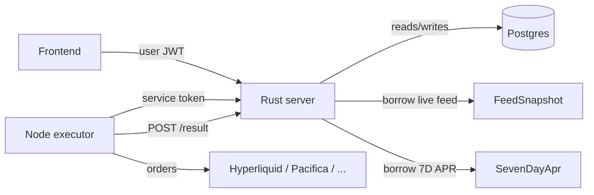

# Funding-Rate Arbitrage Automation

This document describes the automation layer that lets a user delegate
position management on Hyperliquid ↔ Pacifica (and other allowed venues) to
a backend service. Rust holds the **decision engine, configuration,
runs, and append-only audit log**. Execution itself — placing/closing
orders on the venues — runs in an **external Node service** that polls
Rust via a small internal HTTP API.

> Status of the previous design: the in-process Rust executor that
> created `hedge_intents` rows for automation has been **removed**.
> `automation_runs.current_hedge_intent_id` and
> `automation_actions.hedge_intent_id` are still present in the schema
> for backwards-compat with manual hedge-intent flows, but the
> automation pipeline no longer writes to them. Position state lives in
> `automation_runs.current_asset` + `current_legs`.

---

## 1. Architecture



Responsibilities:

| Component | Owns |
|---|---|
| **Rust server (this repo)** | `automation_configs`, `automation_runs`, `automation_actions`, recommendation engine, lease lifecycle |
| **Rust executor (`bin/executor`)** | Live feed ingestion + 7D-APR cron only. **No automation execution.** |
| **Node executor (external)** | Polls `/internal/automation/intents/due`, executes orders via Turnkey/exchange APIs, reports results |

Failure semantics:

- The same intent can be polled by multiple Node workers — leases
  prevent duplicate execution.
- If a Node worker crashes mid-execution, the lease expires and another
  worker can pick the intent up. The result-callback path is idempotent.
- After 3 consecutive failed/partial-failed callbacks, the run is moved
  to `FAILED` automatically.

---

## 2. Metric definitions

Both metrics are normalized to **annualized APR percent**. User-facing
thresholds (`minAprToEnter`, `exitIfAprBelow`) are interpreted in this
unit.

### `NET` (live)

For each candidate symbol, the live feed exposes a per-hour funding rate
on each venue. We pair the two best venues (lowest funding goes long;
highest funding goes short) and compute:

```
metric_value_apr_pct = (short_rate_per_hour - long_rate_per_hour)
                       * 24 * 365 * 100
```

If a venue is missing or its `funding` field is `None` the symbol is
skipped.

### `SEVEN_D` (cron)

`crates/db` stores 7-day cumulative funding spread per symbol/pair. We
extrapolate to APR using:

```
metric_value_apr_pct = total_spread_pct_over_7d * (365 / 7)
```

Same threshold semantics apply.

---

## 3. Database schema

### `automation_configs`

Per-user config. Edits take effect for **new** runs only — active runs
keep the snapshot they were created with.

| Column | Type | Notes |
|---|---|---|
| `user_id` | UUID PK | FK → `users.id` |
| `apr_mode` | `NET \| SEVEN_D` | defaults to `NET` |
| `min_apr_to_enter` | `DOUBLE` | annualized % |
| `exit_if_apr_below` | `DOUBLE` | annualized % |
| `rebalance_to_better_pair` | `BOOL` | |
| `min_rebalance_improvement_bps` | `INT` | hysteresis |
| `min_time_between_actions_sec` | `INT` | cooldown |
| `cooldown_after_error_sec` | `INT` | back-off after failures |
| `max_position_size_usd` | `DOUBLE` | upper bound on margin |
| `max_leverage` | `DOUBLE` | filters out venues that can't honour it |
| `max_actions_per_day` | `INT` | daily cap |
| `excluded_assets` | `JSONB` | array of symbols (uppercased) |
| `allowed_exchanges` | `JSONB` | defaults to `["hyperliquid","pacifica"]` |
| `max_slippage_bps` | `INT` | passed to Node, default `50` |
| `reduce_only_on_close` | `BOOL` | passed to Node, default `true` |

### `automation_runs`

One run per user at a time (enforced by partial unique index on `status='ACTIVE'`).

Important columns:

- `status`: `DRAFT | ACTIVE | PAUSED | STOPPING | STOPPED | FAILED`
- `*_snapshot` fields: copy of config at create-time (immutable)
- `current_asset`, `current_legs`: position state — **source of truth** for what the run is currently holding
- `last_decision_id`, `last_decision_hash`: stable dedupe markers
- `consecutive_failures`: increment on each FAILED/PARTIAL_FAILURE callback; once `>= 3` the run flips to FAILED
- `current_hedge_intent_id`: **deprecated** for automation; only kept for the manual hedge-intents flow

### `automation_actions`

Append-only audit + lease + result store.

Key columns:

- Idempotency: `UNIQUE (run_id, action_type, asset, legs_hash, as_of_bucket)`
- `status`: `PENDING | IN_PROGRESS | SUCCEEDED | FAILED | PARTIAL_FAILURE`
- Lease: `leased_by`, `leased_until`
- Result: `node_action_id`, `started_at`, `finished_at`, `result_json`
- `hedge_intent_id`: **deprecated** for automation flow

Lifecycle:

```
PENDING --(GET /due leases it)--> IN_PROGRESS --(POST /result)--> SUCCEEDED | FAILED | PARTIAL_FAILURE
```

If `leased_until` expires while still `IN_PROGRESS`, the next `/due`
poll re-leases the row.

---

## 4. Public API (user JWT)

Mounted at `/automation/*` behind `require_auth`.

| Method | Path | Purpose |
|---|---|---|
| GET | `/automation/config` | fetch user config (or defaults) |
| PUT | `/automation/config` | upsert config |
| GET | `/automation/best-pair?mode=NET\|SEVEN_D` | preview recommendation |
| POST | `/automation/runs` | create + activate a run |
| GET | `/automation/runs` | list user's runs |
| GET | `/automation/runs/{id}` | get a run |
| POST | `/automation/runs/{id}/pause` | ACTIVE → PAUSED |
| POST | `/automation/runs/{id}/resume` | PAUSED → ACTIVE |
| POST | `/automation/runs/{id}/stop` | ACTIVE/PAUSED → STOPPING (the next due-poll emits `EMERGENCY_CLOSE` if a position is open) |
| POST | `/automation/runs/{id}/restart` | STOPPED/FAILED → new ACTIVE run with fresh config snapshot |
| GET | `/automation/runs/{id}/actions` | append-only action log |

### `PUT /automation/config` body (camelCase)

```json
{
  "aprMode": "NET",
  "minAprToEnter": 25,
  "exitIfAprBelow": 5,
  "rebalanceToBetterPair": true,
  "minRebalanceImprovementBps": 50,
  "minTimeBetweenActionsSec": 300,
  "cooldownAfterErrorSec": 900,
  "maxPositionSizeUsd": 1000,
  "maxLeverage": 3,
  "maxActionsPerDay": 20,
  "excludedAssets": ["DOGE"],
  "allowedExchanges": ["hyperliquid", "pacifica"],
  "maxSlippageBps": 50,
  "reduceOnlyOnClose": true
}
```

`maxSlippageBps` and `reduceOnlyOnClose` are pass-through fields — they
are sent to the Node executor on every intent and are not used in
selection logic.

---

## 5. Internal API (Node executor)

Mounted at `/internal/automation/*` behind a service-auth bearer token.
The token is configured via `AUTOMATION_INTERNAL_TOKEN` and compared in
constant time. **No user JWT** is required (or accepted) on this path.

```
Authorization: Bearer <AUTOMATION_INTERNAL_TOKEN>
```

If the token is unset, the endpoints return 401 for every request.

### `GET /internal/automation/intents/due?limit=N`

Returns up to N actionable intents and **leases** each row to the
caller. Headers:

- `X-Worker-Id` *(optional)*: identifies the worker holding the lease.
  If omitted, the server generates a per-request id.

Lease TTL is `AUTOMATION_LEASE_TTL_SEC` (defaults to 60). Idempotency:
`HOLD` and `NOOP_BELOW_MIN` decisions never produce intents, but
`last_recommendation_at` is still bumped so we don't re-evaluate the run
on every poll.

#### Intent payload (v1)

```json
{
  "intentId": "8e3...",
  "userId": "f01...",
  "runId": "5b7...",
  "asOfMs": 1770000000000,
  "asOfBucket": 118000000,
  "action": "OPEN | CLOSE | REBALANCE | EMERGENCY_CLOSE",
  "aprMode": "NET",
  "metricValueAprPct": 265.12,
  "asset": "BTC",
  "longExchange": "hyperliquid",
  "shortExchange": "pacifica",
  "referencePrice": {
    "symbol": "BTC",
    "px": "100000.12",
    "source": "mark",
    "tsMs": 1770000000000
  },
  "sizing": {
    "targetMarginUsd": "1000",
    "leverage": 3,
    "maxPositionSizeUsd": "2000"
  },
  "constraints": {
    "maxSlippageBps": 50,
    "reduceOnlyOnClose": true
  }
}
```

minor 
Notes:

- `intentId` is the `automation_actions.id` UUID. Derived from the
  idempotency tuple `(run_id, action_type, asset, legs_hash, as_of_bucket)`.
- `referencePrice.px` is a **string decimal** to preserve precision over
  the wire. v1 sources `mark` (preferred long-leg, fallback short-leg).
- Rust **only emits executable intents when `referencePrice` is present**.
  If the live feed does not contain a usable mark price for either leg,
  the decision is still evaluated (run tick is recorded) but **no intent**
  is returned to Node for that run.
- `EMERGENCY_CLOSE` is emitted only for runs in `STOPPING` that still
  hold a position. It bypasses cooldown/hysteresis. The `legs[]` are
  the run's *current* legs, not the global best pair.

### `POST /internal/automation/intents/{intentId}/result`

Node calls this once it has finished (or partially finished) executing
an intent.

Request body:

```json
{
  "status": "SUCCEEDED | FAILED | PARTIAL_FAILURE",
  "nodeActionId": "uuid",
  "startedAtMs": 1770000000000,
  "finishedAtMs": 1770000005000,
  "legs": [
    {
      "venue": "hyperliquid",
      "ok": true,
      "turnkeyActivityId": "act_...",
      "exchangeRequest": { "summary": "..." }
    },
    {
      "venue": "pacifica",
      "ok": false,
      "turnkeyActivityId": "act_...",
      "errorMessage": "Pacifica API request failed"
    }
  ],
  "errorMessage": "optional top-level"
}
```

Response:

```json
{
  "intentId": "8e3...",
  "accepted": true,
  "runStatus": "ACTIVE"
}
```

`accepted=false` means the action was already terminal (idempotent
re-delivery). `runStatus` reflects the run state after applying the
callback.

State transitions applied to the run:

- `SUCCEEDED` for `OPEN`/`REBALANCE`: set `current_asset` + `current_legs`, increment `actions_today`, reset `consecutive_failures`.
- `SUCCEEDED` for `CLOSE`/`EMERGENCY_CLOSE`: clear `current_asset`/`current_legs`. If the run was in `STOPPING`, transition to `STOPPED`.
- `FAILED` / `PARTIAL_FAILURE`: increment `consecutive_failures`. If it reaches `3`, the run is moved to `FAILED` (no more intents emitted).

---

## 6. Recommendation engine

Lives in `crates/server/src/services/automation.rs`. Pure / no I/O.

Inputs:

- `FeedSnapshot` (live)
- `SevenDayApr` (cron)
- `EffectiveConfig` (run snapshot or live config)
- Optional `CurrentRunState` (current asset/legs/actions_today/last_action_at)

Outputs `Recommendation` with the actionable verb plus the inputs that
went into the decision (for replayability and debugging).

`compute_emergency_close` is a separate entry point used for STOPPING
runs that hold a position; it does not consult the candidate list and
simply emits `EMERGENCY_CLOSE` on the run's *current* pair.

### Hashing

- `compute_legs_hash(legs)` — order-independent over `(exchange, side)`. Used in `automation_actions` idempotency.
- `compute_decision_hash(asset, legs, mode, bucket)` — bucketized so two equivalent decisions in the same time window collapse to one row.
- `compute_config_hash(config)` — used to populate `automation_runs.config_hash` for "why did it pick X?" debugging.

All three use FNV-1a 64-bit (deterministic, stable, non-cryptographic).

### Constants

- `MAX_CONSECUTIVE_FAILURES_BEFORE_RUN_FAILED = 3`
- `DEFAULT_LEASE_TTL_SEC = 60`
- `EVAL_INTERVAL_SEC = 15`
- `DEFAULT_POLL_INTERVAL_SEC = 15` (used to bucket `as_of_bucket`)

---

## 7. Configuration

| Env var | Required | Default | Notes |
|---|---|---|---|
| `AUTOMATION_INTERNAL_TOKEN` | yes (for /internal) | none | shared bearer the Node executor sends |
| `AUTOMATION_LEASE_TTL_SEC` | no | 60 | lease duration handed to Node |

When `AUTOMATION_INTERNAL_TOKEN` is unset the internal endpoints return
401 for every request — this is the safe default.

---

## 8. Migration history

| Version | Adds |
|---|---|
| `V12__automation_tables.sql` | initial `automation_configs/runs/actions` |
| `V13__automation_intent_lifecycle.sql` | lease columns (`leased_by/until`), result columns (`node_action_id`, `started_at`, `finished_at`, `result_json`), `consecutive_failures`, `max_slippage_bps`, `reduce_only_on_close`. Backfills `SUCCESS → SUCCEEDED`. |

---

## 9. Operational checklist

- Run DB migrations on deploy (`db::run_db_migrations`).
- Set `AUTOMATION_INTERNAL_TOKEN` on both the Rust server and the Node executor.
- Node executor pseudocode:

```
loop forever:
  intents = GET /internal/automation/intents/due?limit=10  (Bearer token, X-Worker-Id)
  for each intent in intents:
    try:
      execute_on_venues(intent)
      POST /internal/automation/intents/{intent.intentId}/result
        body: { status: "SUCCEEDED", legs: [...], startedAtMs, finishedAtMs, nodeActionId }
    except partial:
      POST /result with status "PARTIAL_FAILURE", legs marked ok/!ok
    except total:
      POST /result with status "FAILED", errorMessage
  sleep(eval_interval)
```

- Idempotency invariant: two workers calling `/due` in the same window
  will never see the same intent, and re-delivering a `/result` for a
  terminal action is a no-op.

---

## 10. Smoke test

```sh
# 1. Configure for the test user
curl -XPUT http://localhost:8000/automation/config \
  -H "Authorization: Bearer $USER_JWT" \
  -H "content-type: application/json" \
  -d '{
    "aprMode":"NET","minAprToEnter":10,"exitIfAprBelow":2,
    "rebalanceToBetterPair":true,"minRebalanceImprovementBps":50,
    "minTimeBetweenActionsSec":300,"cooldownAfterErrorSec":900,
    "maxPositionSizeUsd":1000,"maxLeverage":3,"maxActionsPerDay":20,
    "excludedAssets":[],"maxSlippageBps":50,"reduceOnlyOnClose":true
  }'

# 2. Create + activate a run
curl -XPOST http://localhost:8000/automation/runs \
  -H "Authorization: Bearer $USER_JWT" \
  -H "content-type: application/json" \
  -d '{"targetMarginUsd":1000,"leverage":3}'

# 3. Poll due intents (Node side)
curl http://localhost:8000/internal/automation/intents/due?limit=5 \
  -H "Authorization: Bearer $AUTOMATION_INTERNAL_TOKEN" \
  -H "X-Worker-Id: node-worker-A"

# 4. Report result
curl -XPOST http://localhost:8000/internal/automation/intents/$INTENT_ID/result \
  -H "Authorization: Bearer $AUTOMATION_INTERNAL_TOKEN" \
  -H "content-type: application/json" \
  -d '{"status":"SUCCEEDED","nodeActionId":"...","startedAtMs":1,"finishedAtMs":2,"legs":[]}'
```

---

## 11. Known gaps

- Symbol mapping across venues is currently implicit (same uppercase
  symbol on both sides). When new venues are added with different
  conventions (e.g. `BTCUSDT` vs `BTC-PERP`), introduce a canonical
  mapping table.
- `referencePrice.source` is hard-coded to `"mark"` — no mid/index yet.
- Liquidity filters (min open-interest, max spread) are intentionally
  not enforced in v1.
- Config snapshots on `automation_runs` predate `max_slippage_bps` /
  `reduce_only_on_close`. These two pass-through fields are read live
  from `automation_configs` at intent-build time, not from the run
  snapshot. All other config is snapshotted.
